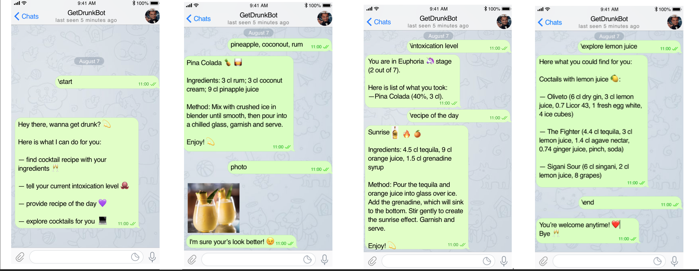
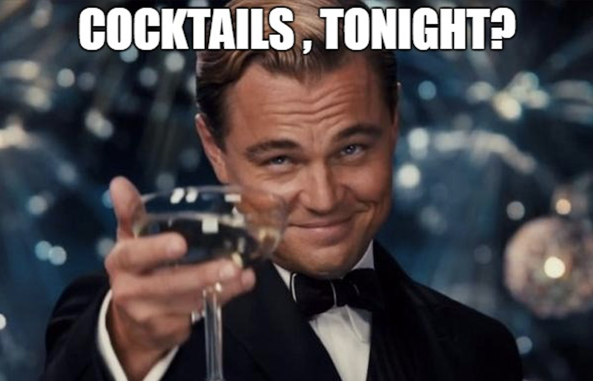

**getdrunk is a telegram bot that recommends you an alcohol drink in return to the list of ingredients you have.**

**Description** 

getdrunk bot supports the next scenarios of communication:
-  ask and receive the recipe of the cocktail in return to ingredients provided
-  ask and receive all the recipes of the cocktails that are similar to the given one
-  ask and receive current intoxication level (in stages: Sobriety, Euphoria, Excitement, Confusion, ..., Coma, Death)
-  ask and receive the image of the cocktail
-  ask and receive any useful information about the cocktail
-  ask and receive the recipe of the day
-  ask and recieve the menu information
-  ask to start the session
-  ask to end the session

**Examples of the dialogs supported**


**The Authors**
- Daria Soboleva, 517 group (@soboleva-daria)
- Nikolay Skachkov, 517 group (@Seriont)
- Alexey Pismenny, 517 group (@alexey-pismenny)
- Mariia Yavorskaia, 517 group (@IavorskaiaMariia)
    
    
**How to install and run**

After clonning, you may use two different ways to run the bot:  

(1) Install the package (Recommended)
```python
   python setup.py install
   python get_drunk_telegram_bot
```
(2) Run the command (Please verify you have Python >=3.6.0) 
```python
   python -m get_drunk_telegram_bot
```



