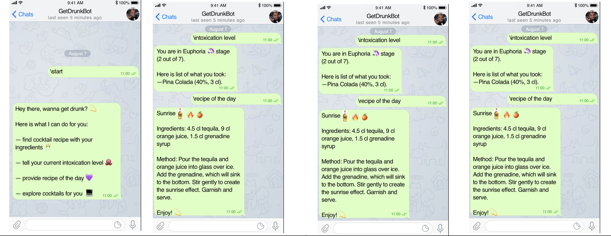
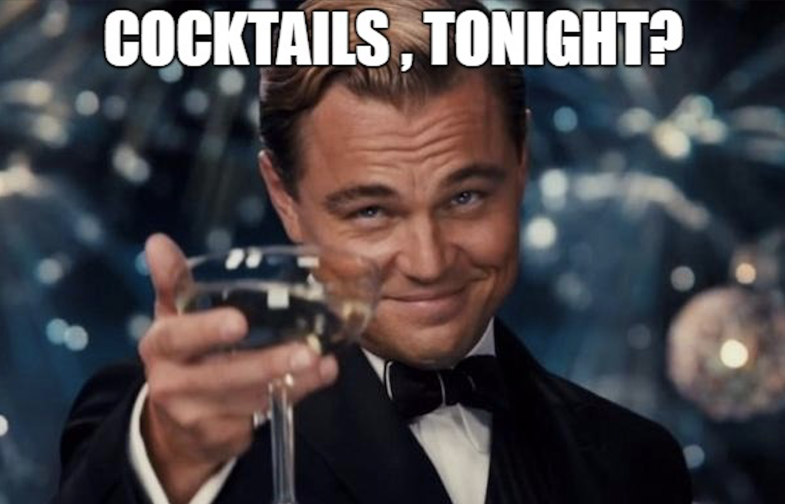

**getdrunk is a telegram bot that recommends you an alcohol drink in return to the list of ingredients you have.**

**Description** 

getdrunk bot supports the next scenarios of communication [TODO]:
-  ask and receive the recipe of the cocktail in return to ingredients provided
-  ask and receive current intoxication level (in stages: Sobriety, Euphoria, Excitement, Confusion, ..., Coma, Death)
-  ask and receive the image of the cocktail
-  ask and receive any useful information about the cocktail (author, date it was invented, degree)
-  ask and receive the recipe of the day
-  ask to start the session
<<<<<<< HEAD
-  ask to end the session`

**Examples of the dialogs supported**

=======
-  ask to end the session

**Examples of the dialogs supported**
[TODO]
>>>>>>> 1c1932332cddaf569c2b0c1234c8364da7a7d798

**The Authors**
- Daria Soboleva, 517 group (@soboleva-daria)
- Nikolay Skachkov, 517 group (@Seriont)
- Alexey Pismenny, 517 group (@alexey-pismenny)
- Mariia Yavorskaia, 517 group (@IavorskaiaMariia)
    
    
**How to install and run**
[TODO]

